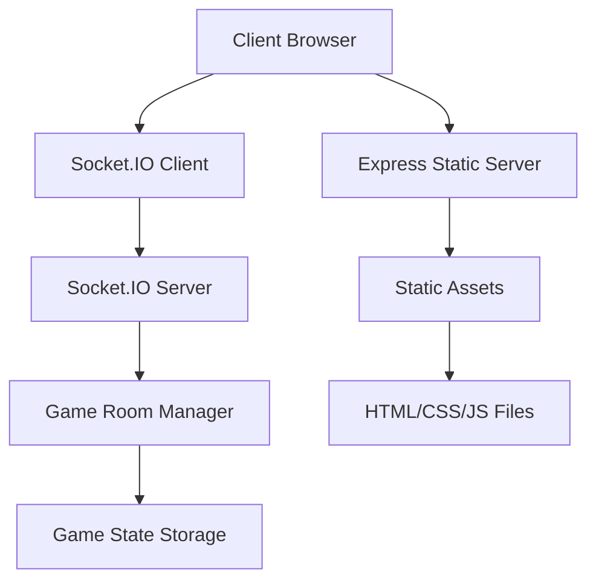

# Design Document

## Overview

Crack the Code is a real-time multiplayer code-cracking game built using Node.js, Express, and Socket.IO for real-time communication. The application follows a client-server architecture where the server manages game state and room coordination while clients handle user interface and local game logic. The system supports both single-player mode (client-side only) and multiplayer mode (server-coordinated).

## Architecture

### High-Level Architecture



### Technology Stack

- **Backend**: Node.js with Express framework
- **Real-time Communication**: Socket.IO for WebSocket connections
- **Frontend**: Vanilla JavaScript, HTML5, CSS3
- **State Management**: In-memory storage using JavaScript Maps
- **Deployment**: Supports AWS Elastic Beanstalk with WebSocket configuration

## Components and Interfaces

### Server Components

#### 1. Express Server (`server.js`)
- **Purpose**: Serves static files and initializes HTTP server
- **Responsibilities**:
  - Serve HTML, CSS, and JavaScript files
  - Initialize HTTP server for Socket.IO
  - Handle CORS configuration

#### 2. Socket.IO Server
- **Purpose**: Manages real-time communication between clients
- **Key Events**:
  - `create-room`: Creates new game room
  - `join-room`: Joins existing room
  - `set-secret-code`: Sets player's secret code
  - `submit-guess`: Processes player guesses
  - `disconnect`: Handles player disconnection

#### 3. GameRoom Class
- **Purpose**: Manages individual game room state
- **Properties**:
  - `roomCode`: Unique 6-character room identifier
  - `hostSocketId`, `guestSocketId`: Player socket identifiers
  - `hostCode`, `guestCode`: Player secret codes
  - `hostAttempts`, `guestAttempts`: Attempt counters
  - `currentTurn`: Current player turn ('host' or 'guest')
  - `gameStarted`, `gameEnded`: Game state flags
  - `hostGuesses`, `guestGuesses`: Guess history arrays

- **Methods**:
  - `addGuest()`: Adds second player to room
  - `setHostCode()`, `setGuestCode()`: Sets player codes
  - `checkGameReady()`: Validates if game can start
  - `switchTurn()`: Alternates player turns
  - `addGuess()`: Records player guess and feedback

#### 4. Game Room Manager
- **Purpose**: Manages collection of active game rooms
- **Implementation**: JavaScript Map storing room code to GameRoom mappings
- **Responsibilities**:
  - Create and store new rooms
  - Retrieve existing rooms
  - Clean up disconnected rooms

### Client Components

#### 1. CrackTheCodeGame Class (`script.js`)
- **Purpose**: Main client-side game controller
- **State Management**:
  - `currentScreen`: Active UI screen
  - `computerGame`: Single-player game state
  - `multiplayerGame`: Multiplayer game state
  - `socket`: Socket.IO client connection

#### 2. UI Screen Manager
- **Purpose**: Manages navigation between different game screens
- **Screens**:
  - `main-menu`: Initial game selection
  - `computer-game`: Single-player gameplay
  - `multiplayer-menu`: Multiplayer options
  - `create-room-screen`: Room creation interface
  - `join-room-screen`: Room joining interface
  - `multiplayer-game`: Multiplayer gameplay

#### 3. Game Logic Engine
- **Purpose**: Handles core game mechanics
- **Key Functions**:
  - `getFeedback()`: Calculates guess feedback using two-pass algorithm
  - `isValidGuess()`: Validates 4-digit input format
  - `generateSecretCode()`: Creates random 4-digit codes
  - `generateRoomCode()`: Creates unique 6-character room codes

## Data Models

### GameRoom Model
```javascript
{
  roomCode: String,           // 6-character unique identifier
  hostSocketId: String,       // Socket ID of room creator
  guestSocketId: String,      // Socket ID of joining player
  hostCode: String,           // Host's 4-digit secret code
  guestCode: String,          // Guest's 4-digit secret code
  hostAttempts: Number,       // Host's attempt count (0-10)
  guestAttempts: Number,      // Guest's attempt count (0-10)
  maxAttempts: Number,        // Maximum attempts allowed (10)
  currentTurn: String,        // 'host' or 'guest'
  gameStarted: Boolean,       // Game initialization flag
  gameEnded: Boolean,         // Game completion flag
  hostGuesses: Array,         // Host's guess history
  guestGuesses: Array         // Guest's guess history
}
```

### Guess Model
```javascript
{
  guess: String,              // 4-digit guess
  feedback: Array,            // ['correct', 'wrong-position', 'not-in-code']
  attempt: Number             // Attempt number (1-10)
}
```

### Client Game State Models
```javascript
// Computer Game State
{
  secretCode: String,         // Generated 4-digit code
  attempts: Number,           // Current attempt count
  maxAttempts: Number,        // Maximum attempts (10)
  gameOver: Boolean           // Game completion flag
}

// Multiplayer Game State
{
  roomCode: String,           // Current room code
  isHost: Boolean,            // Player role flag
  playerRole: String,         // 'host' or 'guest'
  yourCode: String,           // Player's secret code
  yourAttempts: Number,       // Player's attempt count
  opponentAttempts: Number,   // Opponent's attempt count
  maxAttempts: Number,        // Maximum attempts (10)
  isYourTurn: Boolean,        // Turn indicator
  gameOver: Boolean,          // Game completion flag
  gameStarted: Boolean,       // Game initialization flag
  yourGuesses: Array,         // Player's guess history
  opponentGuesses: Array      // Opponent's guess history
}
```

## Error Handling

### Server-Side Error Handling
1. **Room Not Found**: Returns error message when joining non-existent room
2. **Room Full**: Prevents joining rooms with 2 players already
3. **Invalid Turn**: Rejects guesses when it's not player's turn
4. **Disconnection Handling**: Cleans up rooms and notifies remaining player
5. **Invalid Input**: Validates room codes and secret codes

### Client-Side Error Handling
1. **Connection Errors**: Displays user-friendly messages for server connection issues
2. **Input Validation**: Ensures 4-digit numeric input for codes and guesses
3. **Offline Mode**: Graceful degradation when server is unavailable
4. **Socket Disconnection**: Automatic reconnection attempts and user notification

### Feedback Algorithm Error Handling
- **Duplicate Digit Handling**: Two-pass algorithm correctly handles repeated digits
- **Position Tracking**: Prevents double-counting digits in feedback calculation
- **Edge Cases**: Handles all combinations of correct/wrong position/not in code

## Testing Strategy

### Unit Testing
1. **Feedback Algorithm Testing**:
   - Test all feedback combinations (correct, wrong-position, not-in-code)
   - Test edge cases with duplicate digits
   - Validate feedback accuracy for various code combinations

2. **Game Logic Testing**:
   - Test room creation and joining logic
   - Test turn switching mechanisms
   - Test win/lose/draw conditions
   - Test attempt counting and limits

3. **Input Validation Testing**:
   - Test 4-digit code validation
   - Test room code format validation
   - Test boundary conditions and invalid inputs

### Integration Testing
1. **Socket.IO Communication**:
   - Test real-time message passing between clients
   - Test room synchronization across multiple clients
   - Test disconnection and reconnection scenarios

2. **Game Flow Testing**:
   - Test complete single-player game flows
   - Test complete multiplayer game flows
   - Test error scenarios and recovery

### End-to-End Testing
1. **Browser Compatibility**:
   - Test across different browsers and devices
   - Test mobile responsiveness and touch interactions
   - Test WebSocket support and fallbacks

2. **Performance Testing**:
   - Test multiple concurrent rooms
   - Test server memory usage with many active games
   - Test client performance with large guess histories

### Manual Testing Scenarios
1. **Single Player Mode**:
   - Complete game with win condition
   - Complete game with loss condition (10 attempts)
   - Test feedback accuracy for various guesses

2. **Multiplayer Mode**:
   - Create room and wait for player
   - Join existing room
   - Complete multiplayer game with win/loss/draw
   - Test player disconnection scenarios

3. **Mobile Testing**:
   - Test touch input and keyboard behavior
   - Test screen orientation changes
   - Test responsive layout on various screen sizes